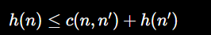
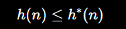
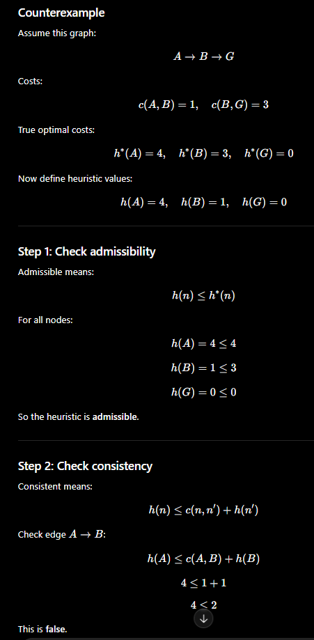
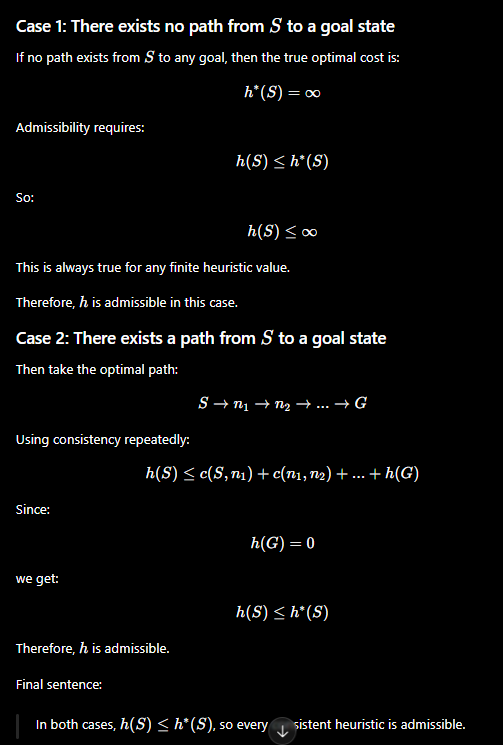
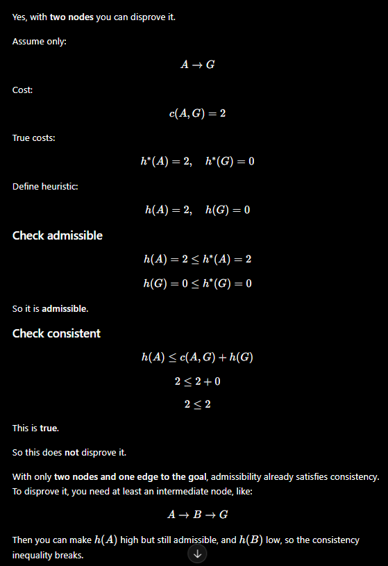

# Exercise 4.1:

## (a) Best-first search
Best-first search is a search strategy that always expands the most promising node first, based on an evaluation function that estimates how good each node is.

## (b) Heuristic function
A heuristic function is a rule or estimate that predicts how close a given state is to the goal, usually by estimating the remaining cost to reach it.

## (c) Admissible heuristic
An admissible heuristic is a heuristic that never overestimates the true cost to reach the goal, meaning it is always optimistic.

## (d) Consistent heuristic
A consistent heuristic is a heuristic where the estimated cost from a state is always less than or equal to the cost of going to a neighbor plus the neighbor’s estimate, ensuring that costs along a path do not decrease.

# Exercise 4.2:

## Consistent heuristic

## Admissable

## Prove or disprove:
## (a) Every admissible heuristic is consistent.

False, admissibility only means never overestimating the true cost, while consistency is a stronger edge-by-edge condition.
## (b) Every consistent heuristic is admissible.

True, every consistent heuristic is admissible because consistency implies the estimate cannot overestimate the true remaining cost
## (c) Breadth-first search, depth-first search, and uniform-cost search are special cases of best-first search.
True, BFS, DFS, and uniform-cost search are special cases of best-first search with different evaluation rules for which node is expanded next.

# Exercise 4.3

Let h1, h2 be two admissible heuristics,
let h+ be defined by h+(n) = h1(n) + h2(n),  
and let finally hmax be defined by hmax(n) =  max(h1(n), h2(n)).
Prove or disprove:

(a) h+ is admissible and dominates h1, h2.

False — (h^+) is not admissible in general because adding two admissible heuristics can overestimate the true cost, even though it dominates (h_1) and (h_2).

(b) hmax  is admissible and dominates h1, h2.

True — (h_{\max}) is admissible because the maximum of two non-overestimating heuristics still does not overestimate, and it dominates both (h_1) and (h_2).

# Exercise 4.4 and Onwards:

## Main Idea
1. Greedy Best-First Search with penalty-based memory (heuristic modification)

## Case 1 — Simple (no memory)
1. Agent gets stuck in loops 
2. Repeats same nodes 
3. Very high number of actions

### Analysis
1. Greedy search is not complete and can loop

## Case 2 — With memory (penalty)
1. Loops 
2. reduced
2. But agent sometimes goes in wrong direction
3. Path is longer than optimal

### Analysis
1. Problem 1
   2. Agent is able to take the next best step but still does not consider the future consequences in a better way 
2. Problem 2
   3. Memory is not perfect becasue penalty [state] += value
   4. Effect is that the agent avoids visited areas but may avoid GOOD paths too
   5. Not a True learning Model
      6. My learning was penalty-based (heuristic modification) NOT LRTA" Learning (updating H(s))

## Case 3 — LRTA* (reference algorithm)

1. The LRTA* algorithm was already provided in the framework. 
2. I implemented a custom agent that improves greedy search by adding penalty-based memory. 
3. This reduces loops but does not fully replicate LRTA*, since it does not update a state-value function.